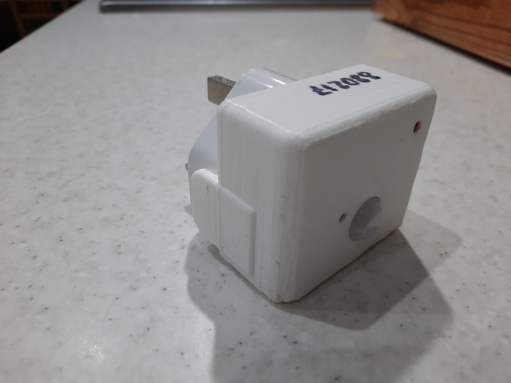
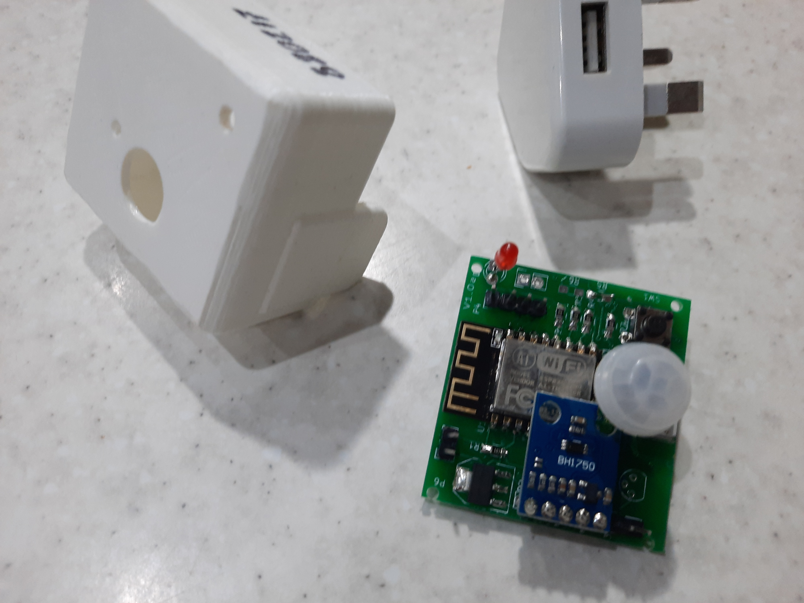
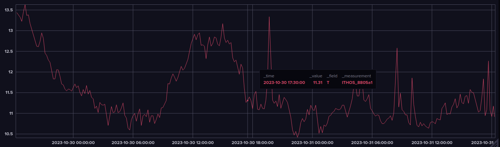
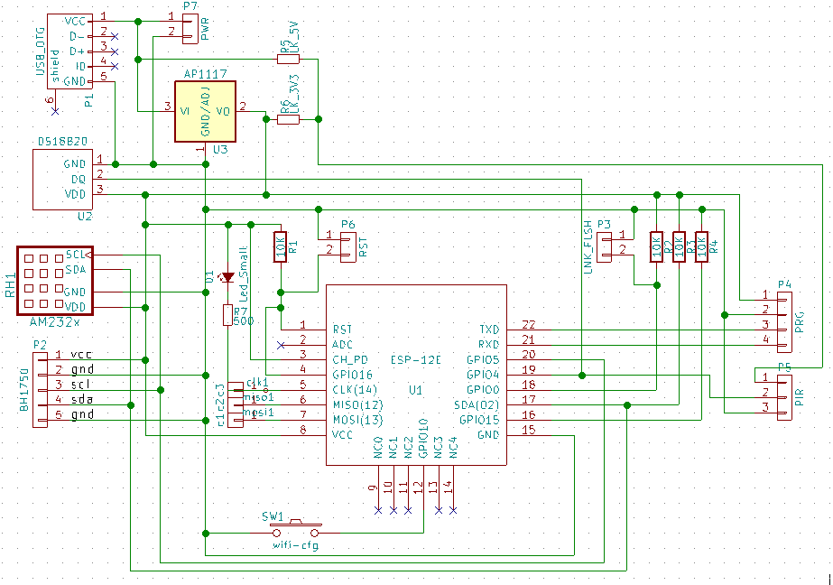

# I.T.H.O.Sense

What is ITHOSense?

The I.T.H.O.Sensor is a multi sensor that neatly fits onto a wall plug. It monitors:

▲ Illumination (light intensity)

▲ Temperature

▲ Humidity

▲ Occupancy (movement)

No cameras or sound – so privacy is maintained.

Place them in strategic positions your home or workplace – get insight and understanding – set alerts to your phone or email.

Why? …

- Ever wondered if you are heating or cooling areas when nobody using them?
- Want to get alerted if your elderly parent does not get up at the time they normally do?
- Want to compare how fast each room in your house warms or cools down (insulation / draft proofing)
- Get notified of moisture (humidity) build up in cold areas.
- See Daily, Weekly, Monthly & Yearly customer activity in your shop or work area and compare changes and help predict busy periods and energy forecasts
- Automated home heating systems will compensate for poor insulation and draft proofing but this brings with it a cost. Find out where the problems are first with ITHOSense and fix them.
- Compare your site data with industry standard benchmarks.
- ITHOSense was originally created to prove to house builders that insulation in one area of a new house was not working effectively. Two ITHOSensors were placed, one in the bedroom and the other in the hall way near by. Over a few days temperature data was collected and graphed using the ITHOSense website.

Use Influx to store and display your realtime data.

Just Enter your Influx Token ID, data centre and Org ID.

